# **UET Department Information AI Agent** 🤖


An intelligent AI agent that answers questions about University of Engineering and Technology (UET) departments using the **Model Context Protocol (MCP)** framework. The agent provides structured information about department facilities, admission requirements, courses, and fees.

---

## **🎯 Table of Contents**
- [📖 Overview](#-overview)
- [✨ Features](#-features)
- [🏗️ Architecture](#️-architecture)
- [🛠️ Installation](#️-installation)
- [🚀 Quick Start](#-quick-start)
- [📁 Project Structure](#-project-structure)
- [🧪 Testing](#-testing)
- [👥 Team Contributions](#-team-contributions)
- [📹 Video Presentation](#-video-presentation)
- [📚 API Documentation](#-api-documentation)
- [🤝 Contributing](#-contributing)
- [📄 License](#-license)

---

## **📖 Overview**

This project implements an **AI Agent via MCP** that answers department-related questions from the **UET Prospectus PDF**. The system includes:

- **MCP-based Agent Core** with intelligent query understanding
- **FastAPI Backend** for RESTful API endpoints
- **Streamlit Frontend** for interactive chat interface
- **Department Guardrail** to ensure scope compliance
- **Knowledge Base** with structured department information

**Scope**: The agent **only answers department-related questions** and responds with "I only answer department information." for out-of-scope queries.

---

## **✨ Features**

| Feature | Description |
|---------|-------------|
| **🤖 MCP Agent** | Model Context Protocol implementation with specialized tools |
| **🔍 Intelligent Query Understanding** | Detects departments and query types automatically |
| **🎨 Streamlit Chat UI** | Beautiful, responsive chat interface |
| **⚡ FastAPI Backend** | High-performance REST API with async support |
| **🛡️ Scope Guardrail** | Ensures only department-related questions are answered |
| **📊 Structured Responses** | Formatted answers with bullet points and sections |
| **📚 Source Citation** | Shows information sources from knowledge base |
| **🔗 Session Management** | Maintains conversation history |
| **🧪 Comprehensive Testing** | 20+ test cases covering all scenarios |

---

## **🏗️ Architecture**

### **System Architecture Diagram**

```mermaid
graph TD
    A[👤 User Query] --> B[🌐 Streamlit Frontend]
    B --> C[⚡ FastAPI Backend]
    C --> D[🤖 MCP Agent Core]
    D --> E[📚 Knowledge Base]
    E --> D
    D --> C
    C --> B
    B --> F[📄 User Response]
    
    style A fill:#3b82f6
    style B fill:#10b981
    style C fill:#8b5cf6
    style D fill:#f59e0b
    style E fill:#ef4444
    style F fill:#3b82f6
```



### **Components Overview**

| Layer | Technology | Purpose |
|-------|------------|---------|
| **Frontend** | Streamlit | Interactive chat interface with message history |
| **Backend** | FastAPI | REST API server with endpoints and validation |
| **AI Agent** | Custom MCP Implementation | Query processing and response generation |
| **Knowledge Base** | Hardcoded Database | Department information storage |
| **Guardrail** | Python Logic | Ensures query scope compliance |

---

## **🛠️ Installation**

### **Prerequisites**
- Python 3.11 or higher
- pip package manager
- Git

### **Step-by-Step Setup**

```bash
# 1. Clone the repository
git clone https://github.com/your-username/uet-ai-agent.git
cd uet-ai-agent

# 2. Create virtual environment
python -m venv venv

# 3. Activate virtual environment
# On Windows:
venv\Scripts\activate
# On Mac/Linux:
source venv/bin/activate

# 4. Install dependencies
pip install -r requirements.txt
```

### **Required Dependencies**

```txt
fastapi==0.104.1
uvicorn==0.24.0
pydantic==2.5.0
streamlit==1.28.0
requests==2.31.0
python-dotenv==1.0.0
```

---

## **🚀 Quick Start**

### **Option 1: Run All Services (Recommended)**

```bash
# From project root directory
python run_all.py
```

### **Option 2: Run Services Separately**

#### **Terminal 1 - Start Backend Server**
```bash
cd backend
python main.py
```

#### **Terminal 2 - Start Frontend Server**
```bash
cd frontend
streamlit run app.py
```

### **Access the Application**

| Service | URL | Description |
|---------|-----|-------------|
| **Chat Interface** | http://localhost:8501 | Main user interface |
| **API Documentation** | http://localhost:8000/docs | Interactive API docs |
| **Health Check** | http://localhost:8000/health | Service status |

---

## **📁 Project Structure**

```
UET_AI_Agent/
│
├── backend/                    # FastAPI Backend
│   ├── main.py                # FastAPI server with endpoints
│   ├── mcp_agent.py           # MCP agent implementation
│   ├── config.py              # Configuration settings
│   └── requirements.txt       # Backend dependencies
│
├── frontend/                  # Streamlit Frontend
│   ├── app.py                # Chat interface application
│   └── styles.css            # Custom CSS styling
│
├── data/                      # Data directory
│   └── UET_Prospectus.pdf    # Source PDF document
│
├── tests/                     # Test suite
│   ├── test_queries.json     # 20+ test questions
│   └── test_agent.py         # Automated tests
│
├── diagrams/                  # Architecture diagrams
│   └── architecture_diagram.png
│
├── requirements.txt           # Main dependencies
├── README.md                 # This file
├── run_all.py                # Combined launcher script
└── .env                      # Environment variables
```

---

## **🧪 Testing**

### **Test Questions Categories**

The system includes **20+ test questions** in three categories:

1. **Department-Related Questions** (10 questions)
   - "What departments are available at UET?"
   - "Tell me about Computer Science department"
   - "What are the admission requirements?"

2. **Tricky Questions** (5 questions)
   - "Are there any sports facilities at UET?"
   - "What is the location of UET?"

3. **Out-of-Scope Questions** (5 questions)
   - "What is the capital of Pakistan?"
   - "Tell me a joke"

### **Run Tests**

```bash
# Run automated tests
cd tests
python test_agent.py

# Test specific endpoint
curl -X POST http://localhost:8000/chat \
  -H "Content-Type: application/json" \
  -d '{"message": "What are the lab facilities in Computer Science?"}'
```

---

## **👥 Team Contributions**

| Team Member | Responsibilities |
|-------------|------------------|
| **Person 1** | PDF processing, data extraction, and chunking |
| **Person 2** | MCP agent implementation, RAG logic, guardrail system |
| **Person 3** | FastAPI backend development, API endpoints, error handling |
| **Person 4** | Streamlit GUI, testing, video recording, documentation |

### **Task Division Details**


---

## **📹 Video Presentation**

### **Video Content (6-10 minutes)**
1. **Architecture Overview** - System design and components
2. **Team Task Division** - Individual responsibilities
3. **Live Demo** - Three question types:
   - Department-related question
   - Tricky question  
   - Out-of-scope question
4. **Project Repository** - Code structure walkthrough

### **Demo Questions**
```python
# Department-Related
"What are the lab facilities in Computer Science?"

# Tricky Question  
"What are the admission requirements for Electrical Engineering?"

# Out-of-Scope
"What's the weather today?"
```

**Video Link**: [Add your video presentation link here]

---

## **📚 API Documentation**

### **Endpoints**

| Method | Endpoint | Description |
|--------|----------|-------------|
| `POST` | `/chat` | Main chat endpoint |
| `GET` | `/health` | Service health check |
| `GET` | `/departments` | List all departments |

### **Sample Requests**

**Chat Request:**
```bash
curl -X POST "http://localhost:8000/chat" \
  -H "Content-Type: application/json" \
  -d '{
    "message": "What are the lab facilities in Computer Science?",
    "session_id": "user_123"
  }'
```

**Response Format:**
```json
{
  "response": "## Computer Science Department\n\n### 🏢 Lab Facilities...",
  "is_department_related": true,
  "sources": ["UET Prospectus Page 45"],
  "session_id": "user_123"
}
```

---

## **🤝 Contributing**

We welcome contributions! Here's how:

1. **Fork** the repository
2. **Create** a feature branch (`git checkout -b feature/AmazingFeature`)
3. **Commit** changes (`git commit -m 'Add some AmazingFeature'`)
4. **Push** to branch (`git push origin feature/AmazingFeature`)
5. **Open** a Pull Request

### **Development Guidelines**
- Follow PEP 8 style guide
- Write comprehensive tests for new features
- Update documentation accordingly
- Use meaningful commit messages

---

## **📄 License**

This project is licensed under the **MIT License** - see the [LICENSE](LICENSE) file for details.

```
MIT License

Copyright (c) 2024 UET AI Agent Team

Permission is hereby granted, free of charge, to any person obtaining a copy
of this software and associated documentation files (the "Software"), to deal
in the Software without restriction, including without limitation the rights
to use, copy, modify, merge, publish, distribute, sublicense, and/or sell
copies of the Software, and to permit persons to whom the Software is
furnished to do so, subject to the following conditions:

The above copyright notice and this permission notice shall be included in all
copies or substantial portions of the Software.
```

---

## **📞 Contact & Support**

For questions, issues, or suggestions:

- **Project Repository**: [https://github.com/your-username/uet-ai-agent](https://github.com/your-username/uet-ai-agent)
- **Issue Tracker**: [GitHub Issues](https://github.com/your-username/uet-ai-agent/issues)
- **Team Email**: [team@example.com](mailto:team@example.com)

---

## **⭐ Acknowledgements**

- **University of Engineering and Technology (UET)** for the prospectus data
- **NLP Course Instructors** for project guidance
- **MCP Framework** for agent architecture inspiration
- **Open Source Community** for amazing tools and libraries

---

<div align="center">

### **🎓 UET Department AI Agent - Bringing Department Information to Your Fingertips!**

[⬆ Back to Top](#uet-department-information-ai-agent-)

</div>
